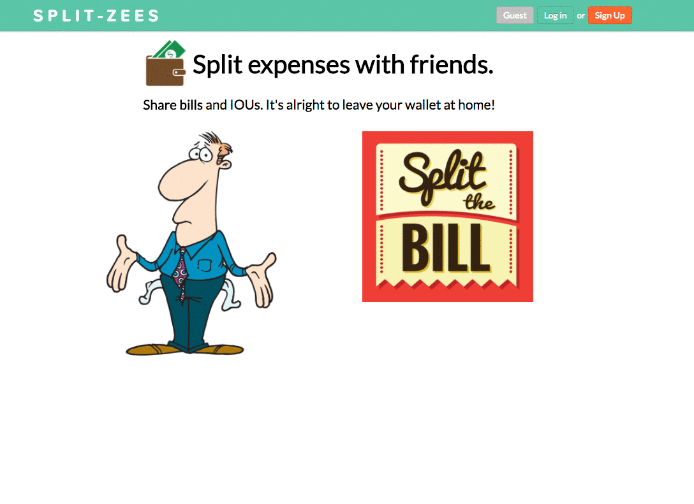

# SplitZees

[SplitZees][heroku]

[heroku]: https://www.splitzees.club/

SplitZees is a full-stack web application inspired by Splitwise.  It utilizes Ruby on Rails on the backend, a PostgreSQL database, React.js and Redux on the frontend.

## Features & Implementation

SplitZees is a bill tracking application that allows users to monitor shared expenses between friends.  SplitZees currently offer four lives features to assist users in tracking expenses.

  * **Adding Friends**: user can add other users as their friends
  * **Adding Bills**: user can choose which friend(s) to allocate expenses to
  * **Tracking Bills**: user can view outstanding balance by friends or outstanding transactions by friend
  * **Settling Bills**: user can settle individual bills or outstanding balance by friend

### Add Friends

In order to allow users to add friends and split expenses, the database contains a friendship table.  The table contains two columns: user_id and friend_id.  This allows the database to join the current user with another user through their user id and create an one to one association.  To prevent duplication, the friendship model incorporates an uniqueness validation to avoid users from adding the same friend if the association has been established in the past.  Each friendship is also indexed for faster querying.

On the front-end, two lists are fetched once the user logs in.  A friends list, which is from the friendship table, is rendered on the left side bar component. A prospective friends list is also stored as a slice of state to allow user to add other users.  Once a new friendship is established, the new friend will then be moved from prospective friend to the friends list in both the react components as well as the database.

### Adding Bills

To add bills, the user will click on the Add a bill a button, which will render a modal for the user to input pertinent information for bill creation.  The user can add friend(s) who participated in the transaction, bill description, amount and date.  Once all information is submitted bu user, the application will send a request back the database.  The bill detail will be passed into two different tables.  The transaction will be recorded at the bill table, which retains all the bill information, and also add a payer_id for the user who paid for the bill.  In addition, friend(s) who participated in the transaction will also be recorded in the owers table along with the amount they owe to the payer.  After both entries are created, the user controller will return outstanding balances by friends and bills by friend back to front to be render by React.  

### Tracking Bills

The dashboard component shows a snapshot of your net balances by friends.  If there is any changes in the balance, the component will render the new state and display the updated balances.  Users can also view all the outstanding transaction by friend through the friends list on the left side bar.  Once an individual friend is clicked, the route paths is redirected to the friends transaction page and the dashboard component will be swapped for transaction detail component.  

### Settling Bills

To settle a bill, the user will need to click on the settle up button, which will activate the settle up modal.  The user can settle by friend or by bill.  If user chooses to settle by friend, the user controller will query all bills associated between the two users by their user id and update the owers table paid status from false to true for all bills related to the two users.  If user settles a specific bill, the user controller will query the owers table by the specific bill id and update paid status to true for that specific entry in the owers table.  

## Future Directions for the Project

Below are the upcoming features that are expected to be rolled out in the next update.

### Resetting password

Reset link will be sent to user's email address if they need to reset their password.  Action Mailer will be implemented in the back to enable email correspondence with the user.

### Removing erroneous bills

Allow user to remove bills from the transaction component.  Will need to add button where its intuitive for user to access the button to edit bill details.  
